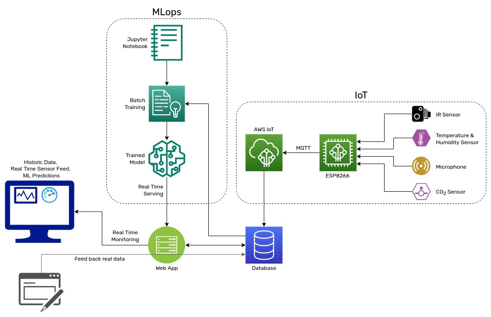

# AIoT food storage system

## Problem Statement

### Definition

Famine and hunger are both rooted in food insecurity. Chronic food
insecurity translates into a high degree of vulnerability to famine and
hunger; ensuring food security presupposes elimination of that
vulnerability. And tackling the root of the food supply chain, the
storage facilities, can greatly improve food security in developing and
developed countries where food production is usually large & stable.
Proper storage and delivery of food ultimately determines the status of
food security in such countries.

### Challenges

The major challenge with this project is the availability of storage
facility data. Most of the cold storages do not record any form of data
and the very few that do are owned by private firms that do not publicly
release their data. Another hurdle we might face would be the accuracy
of pest detection.

### Scope

This project aims to improve storage of perishable food articles in cold
storage facilities and grain silos by using various sensors to keep
environmental conditions inside such facilities in check, and detect &
alert the presence pests. It would also eliminate the need for a person
to enter and manually inspect. It also aims to use Machine Learning to
determine the best temperature and humidity for long preservation of the
food articles and predict spoilage.

## Background and Related Work

-   [Monitoring carbon dioxide concentration for early detection of
    spoilage in stored
    grain](https://www.researchgate.net/publication/275970992_Monitoring_carbon_dioxide_concentration_for_early_detection_of_spoilage_in_stored_grain)

-   [Managing stored grain profitably with smart CO 2 sensors and
    AI](https://centaur.ag/early-detection-of-grain-spoilage-using-co2-sensors-and-ai/)

-   [Design and Analysis of a Radio-Frequency Moisture Sensor for Grain
    Based on the Difference
    Method](https://www.researchgate.net/publication/352474523_Design_and_Analysis_of_a_Radio-Frequency_Moisture_Sensor_for_Grain_Based_on_the_Difference_Method)

-   [An AIoT Based Smart Agricultural System for Pests Detection \| IEEE
    Journals & Magazine](https://ieeexplore.ieee.org/document/9200475)

-   [Forecasting of Grain Pile Temperature From Meteorological Factors
    Using Machine Learning \| IEEE Journals &
    Magazine](https://ieeexplore.ieee.org/document/8832145)

-   [Machine learning in agriculture: from silos to
    marketplaces](https://onlinelibrary.wiley.com/doi/epdf/10.1111/pbi.13521)

## Proposed Methodology

In this project we plan to use a wifi based IoT platform. We would use
temperature and humidity sensor for facility's climate control. For pest
detection we plan to use standard microphones to pick up noises that the
pests might make and infrared imaging to further accurately detect pests
in the line of sight of the sensor. To detect spoilage of food articles
we plan on using CO~2~ sensor. All these data will be sent to a web
server in the cloud for real time monitoring using a web portal and also
long term archival. This communication would be over a low overhead
protocol like AMQP or MQTT to ensure minimum data and power usage and
allow the whole system to run on poor internet connections and on
batteries for longer time. For machine learning we would be using
Boosted Tree regression.

## Experimental Design

### Hardware & Software Requirements

1.  Espressif Wifi MCU
2.  Temperature & Humidity Sensor
3.  CO~2~ Gas Sensor
4.  IR Sensor
5.  Microphone
6.  Cloud web server
7.  Low overhead communication protocol - AMQP or MQTT
8.  sklearn, CatBoost

### Evaluation Measures

We will use metrics like accuracy of the Machine Learning models, pest
detection system and sensors to evaluate the effectiveness of this
project.
